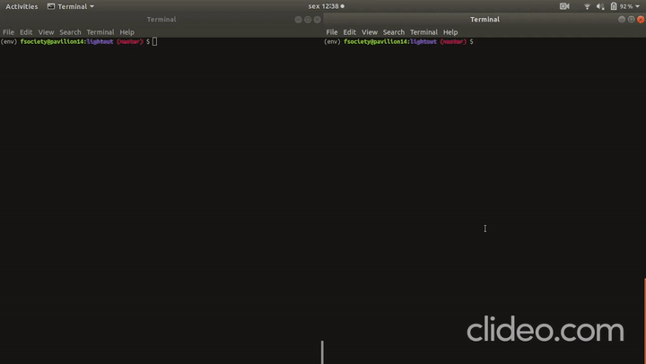

<h1 align="center">
  <br>
  <a href="lightout/static/logo.png"></a>
  <br>
  Lights Out
  <br>
</h1>

<h4 align="center"> Project 1 - Algorithm Project</h4>

<p align="center">
  <a href="#about-the-project">About the project</a> •
  <a href="#how-to-use">How To Use</a> •
  <a href="#credits">Credits</a>
</p>



## About the project

This project was developed for the discipline **Algorithm Project** of FGA College in the semester 02/2019.

The main goal was to develop an application that uses **graph theory** to add some feature.

This application was based on the game 'Lights Out' by Tiger Electronics.

The graphic feature was to develop a **hint button** to make the next best move to win the game.

This feature is based on the **BFS traversal**. Where the current game is modeled as a graph and each branch is a possible move. The first branch that reaches a winning game returns a list of moves needed to win the current game.

## How To Use

  ```bash
  # Clone this repository
  $ git clone https://github.com/projeto-de-algoritmos-2019-2/project-1-graphs/

  # Install virtualenv
  $ sudo pip3 install virtualenv 

  # Create a env
  $ virtualenv -p python3 env

  # Activate the env
  $ source env/bin/activate

  # Install the requirements
  $ pip install -r requirements.txt

  # get in lightout directory
  $ cd lightout

  # Run the application
  $ python app.py
  ```

Note: If you're using Linux Bash for Windows, [see this guide](https://www.howtogeek.com/261575/how-to-run-graphical-linux-desktop-applications-from-windows-10s-bash-shell/) or use `node` from the command prompt.

## Credits

This project used the [AleksaC](https://github.com/AleksaC/LightsOut) project GUI as base to implement the graph feature 
